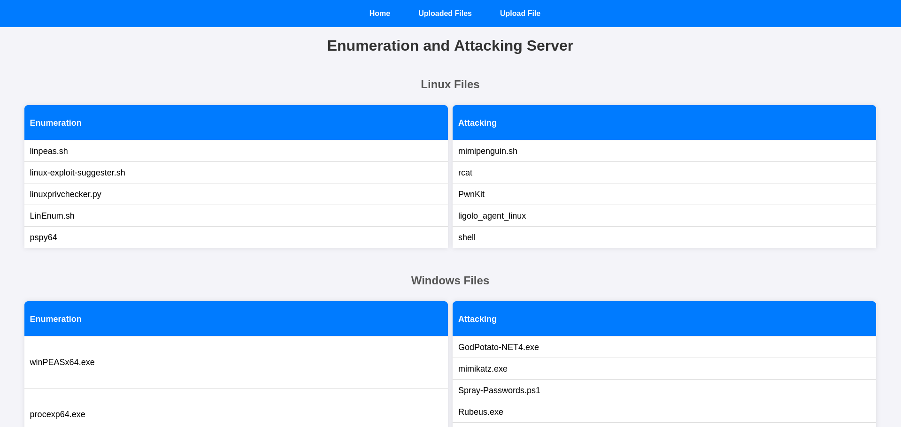
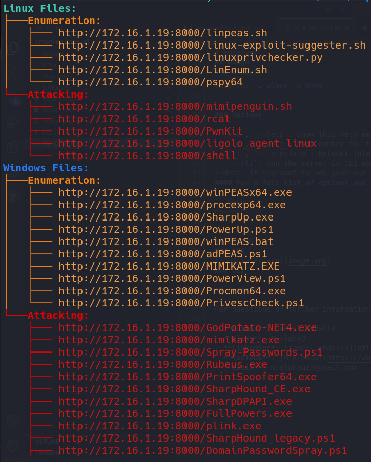

# epserver

epserver is a powerful penetration testing tool designed to help security professionals use the common enumeration, attacking and privilege escalation tools. It simplifies the process of downloading tools to the target machine and facilitates the seamless transfer of files from the victim machine to the attacker's system.

## Features

- **Feature 1**: Host a local web server for pentesting tools
- **Feature 2**: Transfer files from the victim machine to the attacking machine
- **Feature 3**: It has a GUI and CLI interfaces
- **Feature 4**: Copy the tool link with a single click on the tool name from the GUI

## Installation

```bash
git clone https://github.com/jameel3reef/epserver.git
cd epserver
chmod +x install.sh && ./install.sh
```

## Usage

To start using epserver, follow these steps:

### Basic Usage

```bash
epserver [options]
```
Replace `[options]` with the appropriate parameters for your test.

### Example

```bash
epserver -i wlan0 -p 8000
```

### Options

-  `-h`, `--help`: show this help message and exit
-  `-p`, `--port`: Port number for the server (default: 80)
-  `-i`, `--interface`: Network interface to use (default: lo)
-  `--cli`: Run the server in CLI mode
> Note: If you want to add your own tools, add them to the ~/epserver/ linux or windows
#### For a full list of options and their descriptions, run:

```bash
epserver -h
```

## Images

### GUI



### CLI



## Contact

For questions or further information, you can reach out to:

- **Author**: Jameel Abdalla
- **Alias**: MrAlphaQ
- **Linkedin**: [jameel-abdalla](https://www.linkedin.com/in/jameel-abdalla/)
- **YouTube**: [MrAlphaQ](https://www.youtube.com/@MrAlphaQ)
- **Email**: mralphaq23@gmail.com

